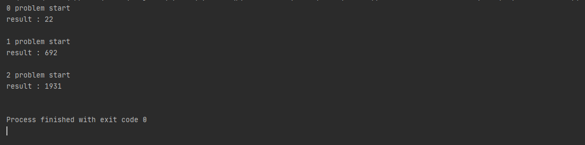

# kakao_elevator

카카오 코테에 대비해 엘리베이터 문제를 풀어보고자 했다.

많이 어렵게 느껴져서 다른 사람의 코드나, 풀이, 질문 등 여러 도움을 받긴했지만 그래도 준수한 결과가 나와주었다.

## 1. 문제 설명

문제와 Elevator 서버 코드: https://github.com/kakao-recruit/2019-blind-2nd-elevator

문제와 해설: https://tech.kakao.com/2018/10/23/kakao-blind-recruitment-round-2/

엘리베이터 4개를 이용해 timestamp를 최소로 하는 코드를 작성하는 문제가 주어졌는데, 여러 특별한 알고리즘을 적용 하는것보단 정석대로 가는것이 편하고, 효율도 나쁘지 않을거 같아서 그런식으로 구현을 하였다.

결과는 다음과 같이 나왔다.